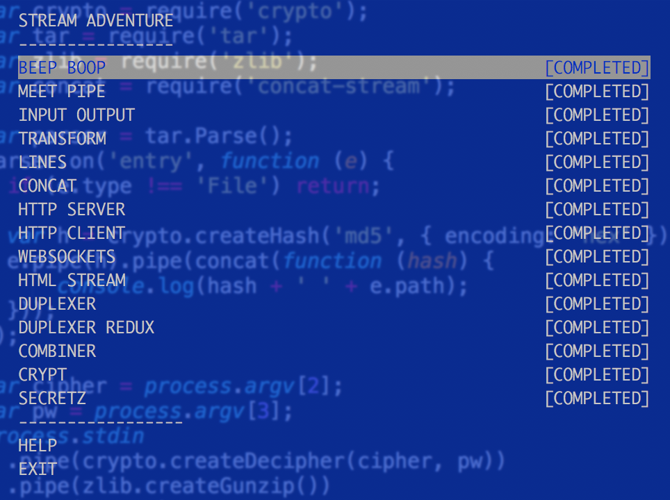

# NodeSchool Stream Adventure Solutions



You can clone this project, all code can run with `stream-adventure verify xxx.js`, good luck!

[stream-adventure](https://github.com/workshopper/stream-adventure)

## 1. BEEP BOOP

```javascript
console.log('beep boop');
```

## 2. MEET PIPE

```javascript
var fs = require('fs');
var file = process.argv[2];
fs.createReadStream(file).pipe(process.stdout);
```

## 3. INPUT OUTPUT

```javascript
process.stdin.pipe(process.stdout);
```

## 4. TRANSFORM

> you need install `through2` package

```javascript
var through = require('through2');
var tr = through(function (buf, _, next) {
    this.push(buf.toString().toUpperCase());
    next();
});
process.stdin.pipe(tr).pipe(process.stdout);
```

## 5. LINES

> you need install `split` package

```javascript
var through = require('through2');
var split = require('split');

var lineCount = 0;
var tr = through(function (buf, _, next) {
    var line = buf.toString();
    this.push(lineCount % 2 === 0
        ? line.toLowerCase() + '\n'
        : line.toUpperCase() + '\n'
    );
    lineCount ++
    next();
});
process.stdin
    .pipe(split())
    .pipe(tr)
    .pipe(process.stdout)
;
```

## 6. CONCAT

> you need install `concat-stream` package

```javascript
var concat = require('concat-stream');

process.stdin.pipe(concat(function (src) {
  var s = src.toString().split('').reverse().join('');
  console.log(s);
}));
```

## 7. HTTP SERVER

```javascript
var http = require('http');
var through = require('through2');

var server = http.createServer(function (req, res) {
  if (req.method === 'POST') {
      req.pipe(through(function (buf, _, next) {
          this.push(buf.toString().toUpperCase());
          next();
      })).pipe(res);
  }
  else res.end('send me a POST\n');
});
server.listen(parseInt(process.argv[2]));
```

## 8. HTTP CLIENT

> you need install `request` package

```javascript
var request = require('request');
var r = request.post('http://localhost:8099');
process.stdin.pipe(r).pipe(process.stdout);
```

## 9. WEBSOCKETS

```javascript
var ws = require('websocket-stream');
var stream = ws('ws://localhost:8099');
stream.write('hello\n');
```

## 10. HTML STREAM

> you need install `trumpet` package

```javascript
var trumpet = require('trumpet');
var through = require('through2');
var tr = trumpet();

var loud = tr.select('.loud').createStream();
loud.pipe(through(function (buf, _, next) {
  this.push(buf.toString().toUpperCase());
  next();
})).pipe(loud);

process.stdin.pipe(tr).pipe(process.stdout);
```

## 11. DUPLEXER

> you need install `duplexer2` package

```javascript
var spawn = require('child_process').spawn;
var duplexer = require('duplexer2');

module.exports = function (cmd, args) {
  var ps = spawn(cmd, args);
  return duplexer(ps.stdin, ps.stdout);
};
```

## 12. DUPLEXER REDUX

```javascript
var duplexer = require('duplexer2');
var through = require('through2').obj;

module.exports = function (counter) {
    var counts = {};
    var input = through(write, end);
    return duplexer({objectMode: true}, input, counter);

    function write (row, _, next) {
        counts[row.country] = (counts[row.country] || 0) + 1;
        next();
    }
    function end (done) {
        counter.setCounts(counts);
        done();
    }
};
```

## 13. COMBINER

> you need install `stream-combiner`, `zlib` package

```javascript
  var combine = require('stream-combiner');
  var through = require('through2');
  var split = require('split');
  var zlib = require('zlib');

  module.exports = function () {
      var grouper = through(write, end);
      var current;
      
      function write (line, _, next) {
          if (line.length === 0) return next();
          var row = JSON.parse(line);
          
          if (row.type === 'genre') {
              if (current) {
                  this.push(JSON.stringify(current) + '\n');
              }
              current = { name: row.name, books: [] };
          }
          else if (row.type === 'book') {
              current.books.push(row.name);
          }
          next();
      }
      function end (next) {
          if (current) {
              this.push(JSON.stringify(current) + '\n');
          }
          next();
      }
      
      return combine(split(), grouper, zlib.createGzip());
  };
```

## 14. CRYPT

> you need install `crypto` package

```javascript
var crypto = require('crypto');
process.stdin
  .pipe(crypto.createDecipher('aes256', process.argv[2]))
  .pipe(process.stdout)
;
```

## 15. SECRETZ

> you need install `tar` package(Do not beyound 3.x.x)

```javascript
var crypto = require('crypto');
var tar = require('tar');
var zlib = require('zlib');
var concat = require('concat-stream');

var parser = tar.Parse();
parser.on('entry', function (e) {
  if (e.type !== 'File') return;

  var h = crypto.createHash('md5', { encoding: 'hex' });
  e.pipe(h).pipe(concat(function (hash) {
      console.log(hash + ' ' + e.path);
  }));
});

var cipher = process.argv[2];
var pw = process.argv[3];
process.stdin
  .pipe(crypto.createDecipher(cipher, pw))
  .pipe(zlib.createGunzip())
  .pipe(parser)
;
```
